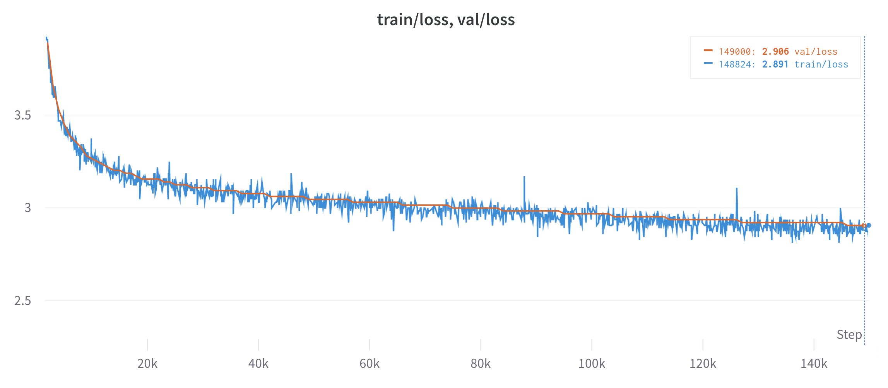

Jax GPT
=======

This is a work-in-progress rewrite of Andrej Karpathy's [nanoGPT](https://github.com/karpathy/nanoGPT) in Jax/Flax.

One of the goals of this project is to try out [`jax.experimental.pjit`](https://jax.readthedocs.io/en/latest/jax-101/08-pjit.html). I'm curious about the performance differences for model size and distribution configurations.

Currently the GPT2 124M parameter model reaches 2.906 validation loss after training on OpenWebText with a TPU V3-32 pod slice for 150K steps (about 20 hours).



# Steps to Reproduce
## Prepare OpenWebText

Clone gpt-jax
```shell
git clone https://github.com/jenkspt/gpt-jax.git
cd gpt-jax
```

Install python dependencies
```shell
pip install -U pip
pip install tqdm
pip install numpy
pip install tiktoken
pip install datasets
pip install tensorflow
```

Prepare data
```shell
python data/openwebtext/prepare.py
```

This will generate the following files:  
`train_0.tfrecord`, `train_1.tfrecord` ... `train_{num_shards}`  
`val_0.tfrecord`, `val_1.tfrecord` ... `val_{num_shards}`

If you're training on a TPU, you should copy these files to a GCS bucket.

## Train with TPU v3-32

1. __Create TPU v3-32__
```shell
ZONE=europe-west4-a
TPU_TYPE=v3-32
VM_NAME=jax-gpt-v3-32

gcloud alpha compute tpus tpu-vm create $VM_NAME \
    --zone=$ZONE \
    --accelerator-type=$TPU_TYPE \
    --version=v2-tf-stable \
    --preemptible
```

2. __Clone repo and install dependencies__
```shell
gcloud alpha compute tpus tpu-vm ssh $VM_NAME --zone=$ZONE \
--worker=all --command="
git clone https://github.com/jenkspt/gpt-jax.git
cd gpt-jax

pip install -U pip
pip install tyro
pip install wandb
pip install -U tensorflow
pip install -U \"jax[tpu]\" -f https://storage.googleapis.com/jax-releases/libtpu_releases.html
pip install flax
"
```

3. __Launch training job__
```shell
EXPERIMENT=gpt2-124m/run_$(date +%Y-%m-%d_%H-%M-%S)
echo $EXPERIMENT
BRANCH=main

gcloud alpha compute tpus tpu-vm ssh $VM_NAME --zone=$ZONE \
--worker=all --command="

export WANDB_API_KEY=$WANDB_API_KEY
export TF_CPP_MIN_LOG_LEVEL=3       # silence annoying TF warnings
export GPT_CONFIG=config/gpt2.yaml  # this is the default GPT config for this run

cd gpt-jax
git fetch --all
git checkout $BRANCH

python3 train.py \
    --out_dir=gs://{your-bucket}/$EXPERIMENT \
    --train_pattern=gs://{your-bucket}/openwebtext/train_??.tfrecord \
    --val_pattern=gs://{your-bucket}/openwebtext/val_??.tfrecord \
    --wandb.name=$EXPERIMENT \
    --wandb.notes=''
"
```

__Don't forget to delete the TPU instance when you're done__
```shell
gcloud alpha compute tpus tpu-vm delete $VM_NAME --zone=$ZONE
```